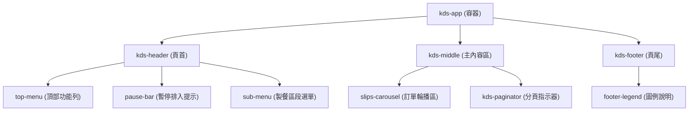

# KDS 智慧廚房控菜系統 - 內容地圖 (Map of Content, MOC)

本文件為 KDS 智慧廚房控菜系統的內容地圖 (MOC)，旨在提供本專案主要檔案 `index.html` 的 DOM 結構、JavaScript 互動邏輯以及 Sass/CSS 樣式模組的關聯指南，幫助開發人員快速理解專案架構。

---

## 📂 1. 專案目錄結構 (Project Directory)

```text
KDS/
├── index.html                   # 系統主入口 (HTML5)
├── MOC.md                       # 本導用內容地圖文件
├── assets/                      # 靜態資源目錄
│   └── icons/                   # SVG 圖標 (Figma 匯出)
├── css/                         # 樣式表目錄
│   ├── main.css                 # SCSS 編譯後的最終樣式檔
│   ├── main.css.map             # 樣式對應檔 (Source Map)
│   ├── reset.css                # 樣式重設檔
│   ├── main.scss                # SCSS 入口引入檔 (管理 @use)
│   ├── _variables.scss          # 全域設計變數 (Colors, Spacing, Typography)
│   ├── components/              # 元件級 SCSS 模組
│   │   ├── _hourglass.scss      # 等候時間沙漏動畫與配色
│   │   ├── _icon-button.scss    # 打勾/打叉/取消按鈕樣式
│   │   ├── _order-slip.scss     # 控菜單 (Slip) 的卡片佈局與狀態樣式
│   │   ├── _paginator.scss      # 分頁點指示器 (Indicator) 樣式
│   │   ├── _sub-menu.scss       # 製餐區段 Tab 及檢視切換樣式
│   │   └── _top-menu.scss       # 頂部導覽列及暫停排入列樣式
│   └── pages/                   # 頁面級 SCSS 模組
│       └── _kds-main.scss       # KDS 主版型與格線佈局樣式
└── js/                          # 腳本目錄
    └── kds.js                   # 系統互動邏輯 (Clock, WaitTimes, Carousel sync, etc.)
```

---

## 🏛️ 2. 主頁面 DOM 結構 (`index.html`)

`index.html` 的結構採用 HTML5 語意化標籤，主要區分為三大區塊：



### 詳細 DOM 節點說明：

1. **`kds-app` (最外層容器)** `[div]`
   - `role="application"`
2. **`kds-header` (頂部控制區域)** `[header]`
   - **`top-menu` (頂部功能列)** `[div]`
     - 時間顯示區塊: `.top-menu__time-block` (即時鐘)
     - 站台選擇 Tab Bar: `.station-tab-bar` (煎台、麵包台、點心台、飲料台、炸台)
     - 暫停排入按鈕: `#pause-order-btn`
     - 設定按鈕: `.settings-btn`
   - **`pause-bar` (已暫停排入狀態列)** `[div]` (當暫停排入時顯示)
   - **`sub-menu` (製餐區段選單)** `[div]`
     - 區段選單 Tab: `待排入區 (含數量)`、`製餐區 (含數量)`、`已出餐區`
     - 訂單檢視切換: `.order-view-toggle` (依訂單 / 依品項)
3. **`kds-middle` (主要製餐看板區)** `[main]`
   - **`#slips-carousel` (Bootstrap 5 Carousel)** `[div]`
     - `.slips-track` (輪播軌道): 透過 JS 動態將 `.slip-col` 進行分頁，每頁 3 欄。
       - **`.slip-col` (單張訂單欄位)**:
         - **`.slip` (控菜單卡片)**:
           - 狀態類別：`.slip--danger` (等候 >= 30分)、`.slip--warning` (等候 >= 10分)、`.slip--canceled` (已取消)
           - `.slip__bar`: 頂部狀態色條
           - `.slip__head`: 訂單表頭 (包含服務方式、單號、等待時間沙漏、桌號、已取消標籤等)
           - `.slip__note`: 訂單備註 (Bootstrap 5 Collapse 可摺疊收合)
           - `.slip__scroll`: 捲動餐點清單 (`role="list"`)
             - **`.slip__order-item` (單一餐點項目)**:
               - 狀態類別：`.slip__order-item--canceled` (已取消餐點)
               - `.slip__qty`: 數量標記 (`.slip__qty--removed`、`.slip__qty--changed`)
               - `.slip__item-info`: 品項名稱與客製化選項
               - `.icon-btn`: 打勾 / 打叉狀態切換按鈕
               - `.slip__combo-head`: 套餐主列與套餐備註 (如果是套餐組件)
             - **`.slip__order-complete` (整單完成按鈕)**
   - **`.kds-paginator` (分頁點)** `[div]`: 動態生成的 Bootstrap Carousel 圓點指示器。
4. **`kds-footer` (底部圖例區)** `[footer]`
   - **`footer-legend` (圖例說明)** `[div]`
     - 製餐等候時間說明：`>= 30分 (紅)`、`>= 10分 (橘)`、`< 10分 (綠)`
     - 餐點異動標示說明：`餐點/訂單取消 (灰)`、`數量異動 (橘)`

---

## ⚡ 3. JavaScript 互動邏輯 (`js/kds.js`)

`kds.js` 負責整個系統的狀態更新與使用者操作行為：

| 模組/函數名稱 | 負責功能說明 | 關聯 DOM 元素 |
| :--- | :--- | :--- |
| `initClock()` | 每秒更新系統時間與日期，格式為 `HH:MM` 與 `M月D日 · 週X` | `#kds-time`, `#kds-date` |
| `initWaitTimes()` | 根據 `data-minutes` 的數值，自動為等待時間標籤套用對應的級距配色 class | `.wait-time` |
| `initIconButtons()` | 監聽餐點右側 icon 按鈕的點擊事件，切換完成/未完成狀態 | `.icon-btn` |
| `initCompleteButtons()` | 整單完成按鈕點擊時，自動將該單內所有未完成的品項標記為完成 | `.slip__complete-btn` |
| `syncSlipPages()` | **核心分頁機制**：自動抓取畫面上可見的訂單，以每頁 3 張的方式重新封裝成 `.slips-page` 放入 Carousel 軌道，並動態重建分頁圓點。 | `.slips-track`, `.slip-col`, `.carousel-indicators` |
| `initRemoveButtons()` | 當點擊已取消訂單的「移除顯示」時，將該訂單隱藏並重新呼叫 `syncSlipPages()` 進行排版 | `.slip__remove-btn` |
| `initCarouselDots()` | 監聽 Bootstrap Carousel 的滑動事件，即時同步下方圓點的 `is-active` 狀態 | `#slips-carousel`, `.paginator__dot` |
| `initStationTabs()` | 切換頂部站台按鈕 (如煎台、點心台) 的選取狀態 | `.station-tab` |
| `initSectionTabs()` | 切換待排入、製餐、已出餐區三個主要頁籤的選取狀態 | `.section-tab` |
| `initOrderViewToggle()` | 切換「依訂單」或「依品項」的檢視模式 | `.order-view-toggle__btn` |
| `initPauseOrder()` | 控制「持續排入/暫停排入」狀態，並同步切換頂部暫停警示列的顯示與按鈕文字 | `#pause-order-btn`, `#pause-bar` |
| `initSlipScrollTouchFlow()` | **手勢分流**：解決子層餐點清單滾動與父層 Carousel 左右滑動的衝突。當判定為水平滑動時，手動控制外層進行頁面切換。 | `.slip__scroll`, `#slips-carousel` |

---

## 🎨 4. SCSS 樣式系統結構

樣式採用模組化的 Sass (SCSS) 架構，最後編譯成 `main.css` 供網頁加載：

1. **`_variables.scss` (設計系統基礎)**
   - 定義全域色彩、字型大小、陰影、間距。
   - 例如等待時間色碼、取消狀態色碼等設計規格。
2. **`components/` (UI 元件庫)**
   - `_order-slip.scss`: 處理訂單卡片的三種狀態樣式 (`--danger`, `--warning`, `--canceled`)、餐點刪除線、數量異動特效。
   - `_top-menu.scss` / `_sub-menu.scss`: 頂部雙層功能列的彈性盒 (Flexbox) 配置與狀態切換。
   - `_icon-button.scss`: 完成打勾/打叉圓圈按鈕的 SVG 轉換與點擊動畫。
   - `_hourglass.scss`: 翻轉沙漏 SVG 的動畫效果。
3. **`pages/_kds-main.scss` (主要佈局)**
   - 負責 App 整體視窗配置 (`1024px` 高寬比鎖定)，及中間訂單滑動區軌道的配置。
